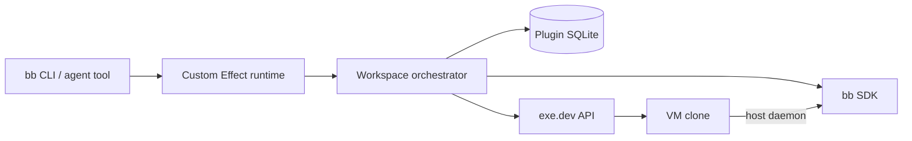

# bb-exe

Disposable [bb](https://getbb.app/) workspaces backed by full [exe.dev](https://exe.dev/) VM clones.

`bb-exe` is an installable, headless bb plugin. It copies a warm project VM, moves its checkout to the latest configured base branch, enrolls the clone as a temporary bb execution machine, and starts an ordinary bb thread inside it. Agent commands, terminals, files, and dev servers then run through bb’s host daemon on the VM—not through a long-lived SSH session.

> Status: early alpha. The end-to-end control plane is implemented and tested with bb’s plugin harness. It has not yet been exercised against a production exe.dev account, so use a dedicated template and review the safety notes before relying on automatic cleanup.

## Why

A worktree isolates source code. A VM also isolates packages, daemons, ports, process trees, databases, global configuration, and resource allocation. Cloning a warm VM retains prepared toolchains and caches without sharing the operating-system state of other agent work.

## Install

This release targets bb `0.40.x` and Node `22.19` or newer.

```bash
bb plugin install git:github.com/bjacobso/bb-exe@main
bb plugin config exe set exeToken '<token from exe.dev/settings>'
bb plugin reload exe
```

The token is declared as a bb secret setting. Prefer entering it in bb’s plugin settings UI when avoiding shell history matters.

Configuration can be committed alongside the project as `bb-exe.config.json`:

```json
{
  "$schema": "https://raw.githubusercontent.com/bjacobso/bb-exe/main/schema.json",
  "version": 1,
  "templateVm": "checkout-main",
  "repoPath": "/home/exe/checkout",
  "remoteName": "origin",
  "baseBranch": "main",
  "server": { "mode": "connect" },
  "resources": { "cpu": 4, "memory": "8GB" },
  "cleanup": { "graceMinutes": 30 }
}
```

Apply it using the bb project ID, then check for drift and run doctor:

```bash
bb exe project diff --project <project-id> --file ./bb-exe.config.json
bb exe project configure --project <project-id> --file ./bb-exe.config.json
bb exe project doctor --project <project-id>
```

The file is read through bb’s primary-host file API. Relative paths resolve from the invoking CLI’s working directory. Unknown properties fail validation, CLI flags override file values deliberately, and secrets are never accepted in the file. See [`examples/`](./examples) for development, large-test, and direct-server configurations.

The equivalent flag-only setup remains available:

```bash
bb exe project configure \
  --project <project-id> \
  --template checkout-main \
  --repo-path /home/exe/checkout \
  --base main \
  --cpu 4 \
  --memory 8GB

bb exe project doctor --project <project-id>
```

By default, the plugin asks bb Connect for the temporary machine credential and uses the returned `getbb.app` server URL. For a directly reachable server, use `server.mode: "direct"` plus `server.url`, or add `--server-url https://bb.example.com` while configuring the project.

## Use

```bash
bb exe create \
  --project <project-id> \
  --prompt "Upgrade Postgres and fix anything that breaks"

bb exe list --project <project-id>
bb exe show --id <workspace-id>
bb exe retain --id <workspace-id> --reason "keep for review"
bb exe destroy --id <workspace-id> --yes
bb exe gc
```

The plugin also registers six native agent tools:

- `exe_create_workspace`
- `exe_get_workspace`
- `exe_list_workspaces`
- `exe_retain_workspace`
- `exe_destroy_workspace`
- `exe_doctor`

The agent destroy tool is safe-only. It cannot force deletion. Human force deletion requires both `--yes` and `--force` on the CLI.

## Lifecycle

Creation is a durable state machine:

1. record the requested workspace in plugin SQLite;
2. copy the template with `--copy-tags=false`;
3. tag and comment the clone with its workspace ownership;
4. fetch the configured remote and create `bb-exe/<workspace-id>` at the current base SHA;
5. write a non-secret ownership marker inside the clone;
6. mint a unique bb host ID and enrollment credentials;
7. install the bb host daemon and wait for it to connect;
8. spawn the root thread on the VM’s unmanaged repository path;
9. record the VM, host, environment, and thread as ready.

Archiving or deleting the root thread schedules cleanup after the project grace period. The reconciler cancels cleanup when the thread is unarchived. Before deletion it verifies the marker, repository state, open threads, and active terminals; then it archives the environment, revokes the temporary host, and removes the VM.



## Effect v4 architecture

The implementation uses Effect `4.0.0-rc.112` end to end:

- Effect Schema decodes CLI/tool input, provider output, and persisted records;
- tagged `BbExeError` values carry structured, redacted failures;
- `BbPlatform`, `ExeClient`, `WorkspaceStore`, and `Orchestrator` are Context services composed with Layers;
- one scoped `ManagedRuntime` is created by the bb plugin factory and disposed through `bb.onDispose`;
- cancellation from bb CLI/tool/service signals reaches Effect fibers and exe.dev `fetch` calls;
- every CLI command, tool, event handler, and background reconciliation pass enters that same runtime.

The single Zod use is the adapter for `bb.sdk.plugins.callRpc`, whose current SDK contract explicitly requires a Zod output schema. All plugin-owned validation remains Effect Schema.

## Template contract and safety

Use a dedicated Linux template VM containing a clean Git checkout at a stable absolute path, project tooling, caches, services, and provider CLIs. The remote must be able to fetch the base branch and push work when needed.

The template must not contain an enrolled bb host identity. Copying one would make clones impersonate the same machine, so doctor and provisioning reject known identity files.

Deletion is intentionally conservative and irreversible:

- ownership requires both exe.dev metadata and the exact in-VM workspace marker;
- automatic and agent cleanup refuse dirty repositories or commits ahead of the base ref;
- cleanup refuses open environment threads and running terminals;
- missing or unverifiable state causes retention, not deletion;
- the exe.dev token, join code, and machine code are redacted from errors and logs.

Current alpha limitation: “ahead of base” is treated conservatively as valuable work even if the workspace branch was pushed. Retain or human-force-delete such a workspace after verifying the remote branch.

## Development

```bash
npm install
npm run check
npx --yes --package bb-app@0.40.0 bb plugin build
bb plugin install path:$PWD
```

The test suite covers command escaping/redaction, strict config files and drift, Effect configuration and provider errors, exe.dev request construction, bb registration, raw agent-tool validation, agent selection, and SQLite persistence using bb’s official fake plugin host.

After installing the plugin and configuring its secret token, an explicitly gated real-account smoke test runs configure → doctor → create → wait → archive → guarded destroy:

```bash
BB_EXE_SMOKE=1 \
BB_EXE_SMOKE_PROJECT=<project-id> \
BB_EXE_SMOKE_CONFIG=./bb-exe.config.json \
npm run smoke:real
```

Set `BB_EXE_SMOKE_KEEP=1` to retain the successful VM. Any failed run is retained automatically for diagnosis. This workflow may create billable resources and is never part of CI. A production run with real bb and exe.dev credentials remains required before a stable release.

The complete product contract, state model, security requirements, and remaining V1 work are in [SPEC.md](./SPEC.md).

## References

- [bb source and plugin SDK](https://github.com/get-bb/bb)
- [exe.dev documentation](https://exe.dev/docs/all)
- [exe.dev API](https://exe.dev/docs/api)
- [Effect](https://effect.website/)

API assumptions were checked against the linked documentation on August 27, 2026.
