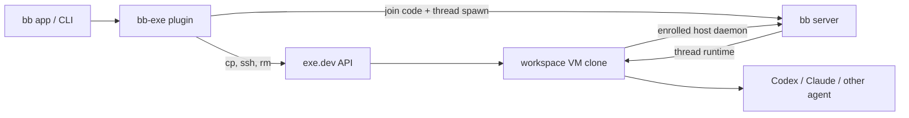

# bb-exe

Disposable [bb](https://getbb.app/) workspaces backed by full [exe.dev](https://exe.dev/) VM clones.

> **Status:** design proposal. There is no installable plugin yet. This repository currently contains the product and implementation design for a first release.

bb normally isolates a thread with a Git worktree on an execution machine. `bb-exe` takes the same idea one level lower: every workspace gets its own Linux VM, cloned from a warm project template that is already configured like `main`.

The result should feel like an ordinary bb thread. The agent, terminal, browser previews, dev servers, and filesystem all run inside the VM. Archive the workspace and the VM is cleaned up after a safety check and grace period.

## Why

A worktree isolates source code. It does not isolate the operating system around it.

A VM-backed workspace can also isolate:

- system packages, daemons, ports, and process trees;
- databases and other mutable local services;
- destructive migrations and infrastructure tools;
- CPU, memory, and disk allocation;
- credentials and network policy attached to the template;
- background processes that outlive an agent turn.

Cloning a warm VM keeps the convenience of a prepared development machine. Toolchains, package caches, services, and the repository are already present, while the plugin still fetches and checks out the exact current `main` commit before starting the agent.

## The intended experience

Configure a bb project once:

```text
Project             checkout
exe.dev template    checkout-main
Repository path     /home/exe/checkout
Base branch         main
Resources           4 CPU / 8 GB RAM
Cleanup             after archive, if safe
```

Then create a workspace from the bb sidebar or the proposed CLI:

```bash
bb exe create \
  --project checkout \
  --prompt "Upgrade Postgres and fix anything that breaks"
```

`bb-exe` will:

1. copy `checkout-main` to a uniquely named exe.dev VM;
2. create a fresh bb machine identity for the clone;
3. fetch and check out the latest `origin/main` on a new workspace branch;
4. enroll the VM as a temporary bb execution machine;
5. start a bb thread in `/home/exe/checkout` on that machine;
6. associate the thread, bb environment, machine, and VM in plugin storage.

From that point on, bb talks directly to the VM's enrolled host daemon. Agent commands do not bounce through a long-lived SSH session.

## Planned commands

These commands describe the proposed interface; they are not implemented yet.

```bash
# Configure or validate one project's template
bb exe project configure --project <id> --template <vm> --repo-path <path>
bb exe project doctor --project <id>

# Create and inspect workspaces
bb exe create --project <id> --prompt <text> [--cpu 4] [--memory 8GB]
bb exe list [--project <id>] [--json]
bb exe show <workspace-id> [--json]

# Lifecycle
bb exe retain <workspace-id>
bb exe destroy <workspace-id> [--yes] [--force]
bb exe gc [--dry-run] [--json]
```

The plugin will also expose equivalent agent tools and a short skill so an agent can create, inspect, and safely retire VM workspaces without scraping UI text.

## How it fits together



The integration uses public capabilities that exist in the current products:

- exe.dev's SSH-shaped HTTPS API can copy, inspect, SSH into, tag, and remove VMs;
- bb's SDK can mint a machine join code, inspect and remove machines, and spawn a thread on an unmanaged path on a selected host;
- bb connect can mint the temporary machine credential needed when the bb server is reached through `getbb.app`;
- bb plugins can add UI, CLI commands, agent tools, skills, background services, storage, and lifecycle event handlers.

The MVP will provide an explicit **New exe workspace** action. Making exe.dev the transparent default choice in bb's standard new-thread workspace picker would require a new, experimental workspace-provisioner extension in bb core; that is a follow-up, not an MVP dependency.

## Template VM contract

The template is a dedicated exe.dev VM, not a normal personal machine. It should contain:

- the repository at a stable absolute path;
- the project's toolchain, dependencies, caches, and local services;
- the agent provider CLIs the project uses;
- a clean Git working tree on the configured base branch;
- a remote that can fetch the configured base branch and push workspace branches.

The template must **not** contain a running or previously enrolled bb host daemon data directory. Copying a bb host identity would make every clone impersonate the same machine. Each clone is enrolled with a newly minted bb host ID after it is created.

Provider login state may be copied with the VM if the user intentionally puts it on the template. Prefer exe.dev integrations for services such as GitHub and LLM access where possible, because those integrations can keep underlying credentials off the VM filesystem.

## Safety model

VM deletion is irreversible, so cleanup is deliberately conservative:

- archiving a root thread schedules cleanup after a grace period rather than deleting immediately;
- unarchiving during the grace period cancels cleanup;
- automatic cleanup refuses to delete a dirty repository or unpushed commits;
- a disconnected VM is retained unless an explicit force policy applies;
- explicit destruction reports the branch, dirty state, and unpushed commits before confirmation;
- the exe.dev API token is a bb secret setting and is never written to project files or logs;
- the plugin never copies a template's bb host identity.

The VM is the isolation boundary, but the plugin itself is trusted code inside the bb server. Users should review its source and grant the exe.dev token only the access they are comfortable automating.

## MVP scope

The first release is intentionally narrow:

- one exe.dev template per bb project;
- Linux template VMs;
- one repository checkout at a configured absolute path;
- workspaces begin at the latest configured remote base branch;
- one exe.dev VM and one bb machine per VM workspace;
- bb connect or an explicitly reachable bb server URL;
- explicit create, retain, inspect, and destroy flows;
- crash-safe reconciliation and conservative garbage collection.

Starting from arbitrary feature branches, pooling warm clones, suspending/resuming VMs, multi-repository workspaces, and replacing bb's built-in workspace picker are follow-up work.

## Design details

The full contract, state machine, storage model, failure handling, security requirements, testing plan, and acceptance criteria live in [SPEC.md](./SPEC.md).

## References

- [bb product site](https://getbb.app/)
- [bb source](https://github.com/get-bb/bb)
- [bb system overview](https://github.com/get-bb/bb/blob/main/docs/system-overview.md)
- [bb multi-machine guide](https://github.com/get-bb/bb/blob/main/docs/multiple-devices.md)
- [bb plugin SDK](https://github.com/get-bb/bb/tree/main/packages/plugin-sdk)
- [exe.dev documentation](https://exe.dev/docs/all)
- [exe.dev API](https://exe.dev/docs/api)
- [exe.dev `cp`](https://exe.dev/docs/cli-cp)
- [exe.dev `rm`](https://exe.dev/docs/cli-rm)
- [exe.dev GitHub integration](https://exe.dev/docs/integrations-github)

Research and API assumptions were checked against the linked documentation on August 27, 2026.
