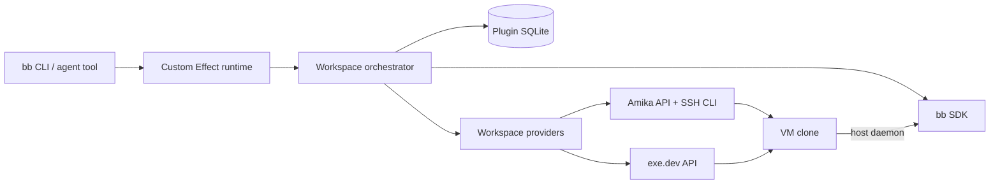

# bb-remote-workspaces

Disposable [bb](https://getbb.app/) workspaces backed by [Exe](https://exe.dev/) VM clones or [Amika](https://amika.dev/) snapshot sandboxes.

`bb-remote-workspaces` is an installable, headless bb plugin. It provisions from a warm project template, moves its checkout to the latest configured base branch, enrolls the clone as a temporary bb execution machine, and starts an ordinary bb thread inside it. Agent commands, terminals, files, and dev servers then run through bb’s host daemon on the VM—not through a long-lived SSH session.

> Status: early alpha. The end-to-end control plane is implemented and tested with bb’s plugin harness. It has not yet been exercised against production Exe or Amika accounts, so use a dedicated template and review the safety notes before relying on automatic cleanup.

## Why

A worktree isolates source code. A VM also isolates packages, daemons, ports, process trees, databases, global configuration, and resource allocation. Cloning a warm VM retains prepared toolchains and caches without sharing the operating-system state of other agent work.

## Install

This release targets bb `0.40.x` and Node `22.19` or newer.

```bash
bb plugin install git:github.com/bjacobso/bb-remote-workspaces@main
bb plugin config bb-remote-workspaces set exeToken '<token from exe.dev/settings>'
bb plugin reload bb-remote-workspaces
```

The token is declared as a bb secret setting. Prefer entering it in bb’s plugin settings UI when avoiding shell history matters.

Configuration can be committed alongside the project as `bb-remote-workspaces.config.json`:

```json
{
  "$schema": "https://raw.githubusercontent.com/bjacobso/bb-remote-workspaces/main/schema.json",
  "version": 1,
  "provider": "exe",
  "templateVm": "checkout-main",
  "repoPath": "/home/exe/checkout",
  "remoteName": "origin",
  "baseBranch": "main",
  "server": { "mode": "connect" },
  "resources": { "cpu": 4, "memory": "8GB" },
  "cleanup": { "graceMinutes": 30 }
}
```

Apply it using the bb project ID, then check for drift and run doctor:

```bash
bb remote-workspaces project diff --project <project-id> --file ./bb-remote-workspaces.config.json
bb remote-workspaces project configure --project <project-id> --file ./bb-remote-workspaces.config.json
bb remote-workspaces project doctor --project <project-id>
```

The file is read through bb’s primary-host file API. Relative paths resolve from the invoking CLI’s working directory. Unknown properties fail validation, CLI flags override file values deliberately, and secrets are never accepted in the file. See [`examples/`](./examples) for development, large-test, and direct-server configurations.

The equivalent flag-only setup remains available:

```bash
bb remote-workspaces project configure \
  --project <project-id> \
  --template checkout-main \
  --repo-path /home/exe/checkout \
  --base main \
  --cpu 4 \
  --memory 8GB

bb remote-workspaces project doctor --project <project-id>
```

## Dev environments as code

For teams that need more than one environment shape, the TypeScript DSL composes provider-neutral environment primitives and synthesizes the same strict JSON consumed by the plugin. Compute is the only provider-specific primitive; repositories, bb connectivity, cleanup, and environments are shared:

```ts
import { Effect } from "effect";
import {
  cleanup, compute, defineSetup, environment, repository, synthesizeJson,
} from "bb-remote-workspaces/dsl";

const app = repository({ path: "/workspace/app", base: "main" });
const standard = compute.exe({
  template: "app-main",
  resources: { cpu: 4, memory: "8GB" },
});

const setup = defineSetup({
  default: "development",
  environments: {
    development: environment({ compute: standard, repository: app }),
    largeTest: environment({
      compute: compute.exe({ template: "app-main", resources: { cpu: 16, memory: "32GB" } }),
      repository: app,
      cleanup: cleanup({ graceMinutes: 60 }),
    }),
    review: environment({ compute: compute.amika({ template: "app-snapshot" }), repository: app }),
  },
});

process.stdout.write(await Effect.runPromise(synthesizeJson(setup, {
  environment: process.argv[2] ?? setup.default,
})));
```

Synthesis is an Effect: missing targets, malformed URLs, invalid resource bounds, and provider-specific constraints fail in the typed error channel. It is deterministic and has no provisioning side effects. Generate and apply an artifact with the included TypeScript runner:

```bash
npm run --silent synth:example -- largeTest \
  > bb-remote-workspaces.config.json
bb remote-workspaces project diff --project <project-id> --file ./bb-remote-workspaces.config.json
bb remote-workspaces project configure --project <project-id> --file ./bb-remote-workspaces.config.json
```

See [`examples/dev-environments.config.ts`](./examples/dev-environments.config.ts) for a complete multi-provider setup. The JSON artifact remains the review and apply boundary, so adopting the DSL does not change credential handling or workspace lifecycle safety.

### DSL examples

| Example | Demonstrates | Run |
| --- | --- | --- |
| [`minimal.dev-environments.config.ts`](./examples/minimal.dev-environments.config.ts) | Smallest single-environment Exe setup with defaults | `npx tsx examples/minimal.dev-environments.config.ts` |
| [`dev-environments.config.ts`](./examples/dev-environments.config.ts) | Shared repository and compute primitives, named profiles, and Exe/Amika selection | `npm run --silent synth:example -- development` |
| [`direct-server.dev-environments.config.ts`](./examples/direct-server.dev-environments.config.ts) | Direct bb connectivity, custom Git refs, resource sizing, pool, and cleanup policy | `npx tsx examples/direct-server.dev-environments.config.ts` |

Select another profile from the multi-environment example by passing `development`, `largeTest`, or `review`. Every command writes JSON to stdout, so it can be inspected directly or redirected into `bb-remote-workspaces.config.json`.

By default, the plugin asks bb Connect for the temporary machine credential and uses the returned `getbb.app` server URL. For a directly reachable server, use `server.mode: "direct"` plus `server.url`, or add `--server-url https://bb.example.com` while configuring the project.

## Providers

Select the infrastructure provider per project with `provider: "exe" | "amika"` in the config file or `--provider exe|amika` on `project configure`. Omitted values default to Exe. This is separate from bb's agent/model provider.

| Provider | `templateVm` | Credentials and setup |
| --- | --- | --- |
| `exe` | Running Exe template VM name | `exeToken` secret setting |
| `amika` | Active Amika snapshot name or ID | `amikaToken` secret setting, Amika CLI and SSH identity on the bb plugin server |

### Amika

Install the [Amika CLI](https://github.com/gofixpoint/amika) on the machine running the bb plugin server, then log in and create its SSH identity:

```bash
amika auth login
amika secret ssh-keygen
bb plugin config bb-remote-workspaces set amikaToken '<Amika API key>'
bb plugin reload bb-remote-workspaces
bb remote-workspaces project configure --project <project-id> \
  --provider amika --template checkout-base \
  --repo-path /home/amika/workspace/checkout
bb remote-workspaces project doctor --project <project-id>
```

Prepare an active snapshot with a clean checkout, Node, Bash, Git, and no enrolled bb identity. See [Amika's snapshot and SSH reference](https://github.com/gofixpoint/amika/blob/main/docs/cli-reference.md) and [the Amika config example](./examples/amika.bb-remote-workspaces.config.json).

Amika provisioning uses the Cloud API at `https://app.amika.dev`; setup and inspection use `amika sandbox --remote ssh`. The API key is passed to the CLI through its environment. Provider-side automatic stop/delete are disabled so bb controls cleanup. Resource overrides (`cpu`, `memory`, `disk`, `pool`) are currently Exe-only and rejected for Amika.

Amika doctor checks API access and snapshot readiness without creating a sandbox. Repository cleanliness, copied bb identity, and SSH connectivity are checked during creation; its doctor result leaves `baseSha` and `copiedBbIdentityCount` null. Provisioning failures retain the sandbox for inspection.

## Use

```bash
bb remote-workspaces create \
  --project <project-id> \
  --prompt "Upgrade Postgres and fix anything that breaks"

bb remote-workspaces list --project <project-id>
bb remote-workspaces show --id <workspace-id>
bb remote-workspaces retain --id <workspace-id> --reason "keep for review"
bb remote-workspaces destroy --id <workspace-id> --yes
bb remote-workspaces gc
```

The plugin also registers six native agent tools:

- `remote_workspaces_create_workspace`
- `remote_workspaces_get_workspace`
- `remote_workspaces_list_workspaces`
- `remote_workspaces_retain_workspace`
- `remote_workspaces_destroy_workspace`
- `remote_workspaces_doctor`

The agent destroy tool is safe-only. It cannot force deletion. Human force deletion requires both `--yes` and `--force` on the CLI.

## Lifecycle

Creation is a durable state machine:

1. record the requested workspace in plugin SQLite;
2. copy the Exe template with `--copy-tags=false`, or provision an Amika snapshot;
3. record provider ownership (Exe metadata or immutable Amika sandbox ID);
4. fetch the configured remote and create `bb-remote-workspaces/<workspace-id>` at the current base SHA;
5. write a non-secret ownership marker inside the clone;
6. mint a unique bb host ID and enrollment credentials;
7. install the bb host daemon and wait for it to connect;
8. spawn the root thread on the VM’s unmanaged repository path;
9. record the VM, host, environment, and thread as ready.

Archiving or deleting the root thread schedules cleanup after the project grace period. The reconciler cancels cleanup when the thread is unarchived. Before deletion it verifies the marker, repository state, open threads, and active terminals; then it archives the environment, revokes the temporary host, and removes the VM.



## Effect v4 architecture

The implementation uses Effect `4.0.0-rc.112` end to end:

- Effect Schema decodes CLI/tool input, provider output, and persisted records;
- tagged `BbRemoteWorkspacesError` values carry structured, redacted failures;
- `BbPlatform`, `WorkspaceProviders`, `WorkspaceStore`, and `Orchestrator` are Context services composed with Layers;
- one scoped `ManagedRuntime` is created by the bb plugin factory and disposed through `bb.onDispose`;
- cancellation from bb CLI/tool/service signals reaches Effect fibers and provider network/SSH calls;
- every CLI command, tool, event handler, and background reconciliation pass enters that same runtime.

The single Zod use is the adapter for `bb.sdk.plugins.callRpc`, whose current SDK contract explicitly requires a Zod output schema. All plugin-owned validation remains Effect Schema.

## Template contract and safety

Use a dedicated Linux template VM containing a clean Git checkout at a stable absolute path, project tooling, caches, services, and provider CLIs. The remote must be able to fetch the base branch and push work when needed.

The template must not contain an enrolled bb host identity. Copying one would make clones impersonate the same machine, so doctor and provisioning reject known identity files.

Deletion is intentionally conservative and irreversible:

- ownership requires Exe metadata or the persisted Amika sandbox ID, plus the exact in-workspace marker;
- automatic and agent cleanup refuse dirty repositories or commits ahead of the base ref;
- cleanup refuses open environment threads and running terminals;
- missing or unverifiable state causes retention, not deletion;
- provider tokens, join code, and machine code are redacted from errors and logs.

Current alpha limitation: “ahead of base” is treated conservatively as valuable work even if the workspace branch was pushed. Retain or human-force-delete such a workspace after verifying the remote branch.

## Renaming and existing installations

The package is now `bb-remote-workspaces`, with CLI namespace `remote-workspaces`, tool prefix `remote_workspaces_`, and config filename `bb-remote-workspaces.config.json`. Install from a local checkout with `bb plugin install path:$PWD`; the bb plugin ID is `bb-remote-workspaces`.

Existing config files without `provider` still select Exe. Legacy records read from the same plugin database default to Exe, and cleanup recognizes legacy Exe ownership tags and marker paths. New workspace records pin their provider and project configuration, so reconfiguring a project does not redirect existing workspace cleanup. A renamed plugin may get a separate bb database; retain or finish old workspaces under the old installation before removing it. Plugin settings and databases are not automatically moved between plugin IDs.

## Development

```bash
npm install
npm run check
npx --yes --package bb-app@0.40.0 bb plugin build
bb plugin install path:$PWD
```

The test suite covers command escaping/redaction, strict config files and drift, Effect configuration and provider errors, exe.dev request construction, bb registration, raw agent-tool validation, agent selection, and SQLite persistence using bb’s official fake plugin host.

After installing the plugin and configuring its secret token, an explicitly gated real-account smoke test runs configure → doctor → create → wait → archive → guarded destroy:

```bash
BB_REMOTE_WORKSPACES_SMOKE=1 \
BB_REMOTE_WORKSPACES_SMOKE_PROJECT=<project-id> \
BB_REMOTE_WORKSPACES_SMOKE_CONFIG=./bb-remote-workspaces.config.json \
npm run smoke:real
```

Set `BB_REMOTE_WORKSPACES_SMOKE_KEEP=1` to retain the successful VM. Any failed run is retained automatically for diagnosis. This workflow may create billable resources and is never part of CI. A production run with real bb and provider credentials remains required before a stable release.

The complete product contract, state model, security requirements, and remaining V1 work are in [SPEC.md](./SPEC.md).

## References

- [bb source and plugin SDK](https://github.com/get-bb/bb)
- [exe.dev documentation](https://exe.dev/docs/all)
- [exe.dev API](https://exe.dev/docs/api)
- [Effect](https://effect.website/)

The Amika adapter was checked against the [Cloud OpenAPI specification](https://app.amika.dev/api/openapi.json) and CLI reference on September 14, 2026. Real-account validation remains required for both providers.
