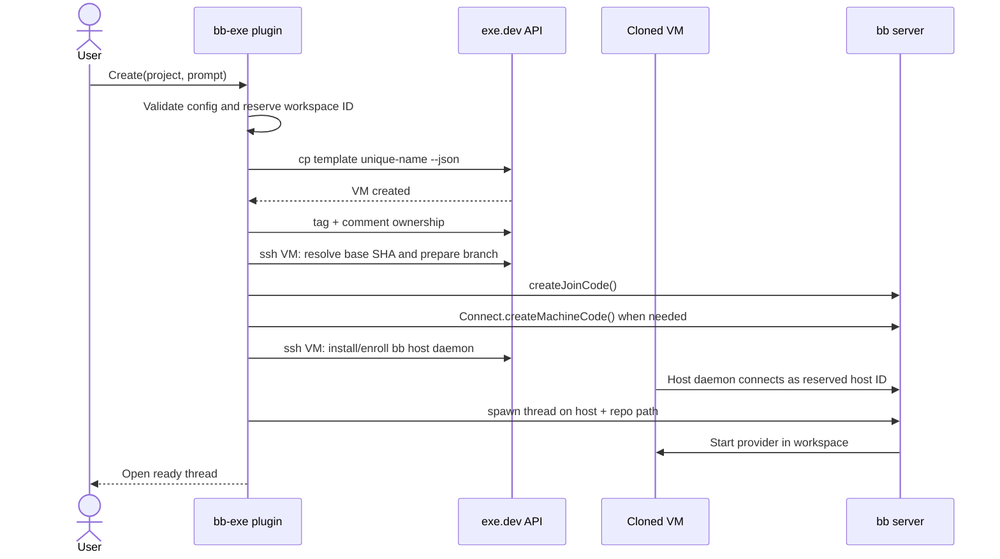

# bb-exe product and implementation specification

| Field | Value |
| --- | --- |
| Status | Implemented alpha; remaining V1 items tracked below |
| Date | August 27, 2026 |
| Plugin ID | `exe` |
| Initial bb target | `0.40.x` |
| Initial platform | Linux guests on exe.dev |

## 1. Summary

`bb-exe` is a trusted bb plugin that provisions one disposable exe.dev VM for each plugin-created workspace, enrolls that VM as a temporary bb execution machine, and starts an ordinary bb thread against a repository inside the VM.

The template VM represents a warm development environment for a project's default branch. The clone carries the operating-system state, toolchains, services, and caches. Before the agent starts, the plugin fetches the remote and creates a clean workspace branch at the exact current base-branch commit.

The MVP does not replace bb's built-in managed-worktree provisioner. It adds an explicit plugin-owned creation flow and then hands execution back to ordinary bb primitives.

### 1.1 Implementation status

The repository now ships the headless lifecycle rather than only this design. The implementation is built around Effect `4.0.0-rc.112` and a custom scoped runtime plugged into the bb extension factory.

| Area | Alpha status |
| --- | --- |
| Effect runtime, Layers, Schema, tagged errors, cancellation | Implemented |
| Secret exe.dev setting and per-project SQLite configuration | Implemented |
| Core doctor checks, clone, ownership metadata, Git preparation | Implemented |
| bb direct/Connect enrollment and root-thread spawn | Implemented |
| CLI, six native tools, and agent skill | Implemented |
| Archive grace period, unarchive reconciliation, guarded deletion | Implemented |
| bb fake-host tests, unit tests, typecheck, bb `0.40.0` build | Implemented |
| Production exe.dev/bb smoke test | Not yet run |
| Plugin page, composer action, realtime progress | Remaining V1 work |
| Retry command, complete orphan GC, pushed-branch detection | Remaining V1 work |
| Provider-CLI and pre-enrollment server-route doctor checks | Remaining V1 work |

The current alpha deliberately treats every commit ahead of the base ref as valuable work. It does not yet distinguish a pushed workspace branch from an unpushed one.

## 2. Problem

bb managed worktrees give concurrent threads independent Git working directories on an execution machine. Some work is not safely isolated by a directory:

- tests bind fixed ports or leave process trees behind;
- migrations mutate a local database or system service;
- agents install packages or change global configuration;
- repositories need expensive, stateful environment setup;
- users want stronger blast-radius and resource boundaries.

A full VM per workspace solves those cases, but manually cloning a VM, preparing Git, enrolling a bb machine, targeting the thread, and later cleaning up both systems is too much lifecycle work for normal use.

## 3. Definitions

**Template VM** — A dedicated exe.dev VM containing a clean project checkout and prepared development environment. It is copied but is never itself used for bb work.

**VM workspace** — The plugin-owned lifecycle object joining an exe.dev VM, a bb execution machine, a bb environment, and one or more bb threads.

**Root thread** — The first thread created for a VM workspace. Its archive event starts the default cleanup policy.

**Base ref** — The configured remote branch, `origin/main` by default.

**Base SHA** — The immutable commit resolved from the base ref during provisioning.

**Control plane** — The plugin's calls to `https://exe.dev/exec` for VM lifecycle and remote command execution.

**Execution plane** — The bb host daemon and agent provider running inside the cloned VM after enrollment.

## 4. Goals

1. Create a ready bb thread inside a fresh VM clone with one deliberate user action.
2. Ensure every clone has a unique bb machine identity.
3. Start code at the exact current remote base SHA even when the warm template is older.
4. Preserve the normal bb thread, terminal, file, diff, browser, and provider experience after provisioning.
5. Reconcile incomplete operations after plugin or bb server restarts.
6. Avoid deleting dirty or unpushed work without an explicit force decision.
7. Provide equivalent UI, CLI, and agent-tool surfaces.
8. Keep API tokens, join codes, machine codes, and provider credentials out of logs and repository files.

## 5. Non-goals for V1

- Replacing bb's standard workspace picker or managed-worktree implementation.
- Running multiple bb VM workspaces on one cloned VM.
- Starting from an arbitrary feature branch or an uncommitted local checkout.
- Copying local untracked files into the VM.
- Supporting Windows guests.
- Creating or maintaining the user's template VM from scratch.
- Suspending, hibernating, snapshotting, or migrating live VMs.
- Automatically merging branches or opening pull requests.
- Public unauthenticated previews.
- Cross-provider credential setup.
- Hard cost budgets or billing enforcement.

## 6. Product requirements

### 6.1 Project setup

The plugin must let the user configure, per bb project:

- exe.dev template VM name;
- absolute repository path inside the template;
- remote name, default `origin`;
- base branch, default `main`;
- optional CPU, memory, disk, and exe.dev pool overrides;
- bb server reachability mode: `connect` or `direct`;
- direct server URL when `direct` is selected;
- cleanup grace period and retention policy;
- maximum concurrent provisioning operations for the project.

The exe.dev API bearer token is a plugin secret setting, not project configuration. The UI must show whether a token exists but must never read it back.

Project setup must include a doctor operation that verifies:

1. the exe.dev token can call `whoami`;
2. the template exists and is running;
3. the repository path exists and is a Git worktree;
4. the worktree is clean;
5. its remote and base branch resolve;
6. the provider CLI selected in bb is installed;
7. no bb host identity or active bb host daemon data directory is present in the template;
8. the bb server is reachable through the selected route.

A failed doctor check blocks creation and returns a specific remediation message.

### 6.2 Create

The create surface accepts:

- project;
- initial prompt;
- optional title;
- optional provider, model, reasoning, permission mode, and service tier;
- optional resource overrides within project policy;
- optional cleanup-policy override.

Submission must return a durable workspace ID immediately. The UI shows provisioning progress and may be closed without cancelling the operation.

### 6.3 Ready workspace

When provisioning succeeds:

- the root thread appears in bb's normal thread list;
- the thread environment host is the cloned VM's bb machine;
- the thread working directory is the configured repository path;
- the repository is on a unique branch based at the recorded base SHA;
- the plugin page links to the bb thread and shows VM, host, branch, age, and cleanup state;
- agent commands, terminals, files, and dev servers run on the cloned VM.

### 6.4 Inspect and retain

The user can inspect:

- plugin workspace ID and state;
- exe.dev VM name and reported status;
- bb machine ID and connection status;
- environment and root-thread IDs;
- base ref, base SHA, and workspace branch;
- dirty and unpushed status when reachable;
- creation, ready, archive, and scheduled-deletion timestamps;
- the last structured error and retry count.

Retaining a workspace cancels scheduled automatic cleanup. It does not change or stop the running thread.

### 6.5 Cleanup

Archiving the root thread schedules cleanup after the configured grace period. Unarchiving it before the deadline cancels that cleanup.

Before automatic deletion, the plugin must verify all of the following:

- no unarchived thread references the environment;
- no agent runtime or terminal owned by the environment is active;
- the Git worktree is clean;
- the workspace branch has no commits absent from its configured upstream, or the project's policy explicitly permits deleting unpushed commits;
- the VM identity still matches the plugin record.

If a check cannot run or fails, the workspace moves to `retained` with a reason. It is not deleted.

Explicit destroy runs the same preflight and shows the findings. `--force` may bypass dirty, unpushed, disconnected, and active-thread gates, but still requires confirmation and an exact workspace ID. An agent tool cannot force deletion in V1.

### 6.6 Garbage collection

The background reconciler identifies:

- plugin records whose VM no longer exists;
- plugin-owned VMs with no plugin record;
- removed bb hosts that still have a VM;
- expired join operations;
- scheduled cleanups whose deadline has passed;
- stale errors eligible for retry.

Orphan discovery must prove plugin ownership through both the `bb-exe` tag and the plugin workspace ID stored in the exe.dev VM comment. Name prefix alone is insufficient authority to delete.

`bb exe gc --dry-run` is the default interactive diagnostic. Destructive garbage collection requires `--yes`, and dirty or unverifiable VMs are retained unless `--force` is also present.

## 7. User surfaces

### 7.1 bb page

The plugin contributes a sidebar page with:

- **New exe workspace** button;
- project/template health;
- active, provisioning, retained, and failed workspace groups;
- VM and bb connection status;
- cleanup countdowns;
- retry, retain, open thread, and destroy actions;
- a project configuration view.

Realtime events update operation progress without polling while the page is open. A low-frequency refetch remains as recovery for missed events.

### 7.2 Composer action

When the composer has a project context, the plugin may contribute **Run on exe.dev**. Activating it opens the plugin create flow with the draft, model settings, and attachments preserved. The MVP must not intercept or silently change the ordinary bb submit action.

### 7.3 CLI

The plugin owns `bb exe` with these subcommands:

```text
project configure
project show
project doctor
create
list
show
retain
destroy
retry
gc
```

Read commands support `--json`. Mutation commands return a stable JSON envelope with `ok`, `workspaceId`, `state`, and a structured error when applicable. No command requires parsing human table output from bb or exe.dev.

### 7.4 Agent tools and skill

Tools:

- `exe_create_workspace`
- `exe_get_workspace`
- `exe_list_workspaces`
- `exe_retain_workspace`
- `exe_destroy_workspace`
- `exe_doctor`

`exe_workspace_destroy` performs only safe deletion. If force would be required it returns the blocking facts and tells the agent to ask the user to use the UI or CLI.

The generated skill explains when a VM is useful, how costs persist while retained, how to commit or push work before cleanup, and why an agent must not manually delete plugin-owned VMs or bb machines.

## 8. Technical constraints and feasibility

### 8.1 Existing bb capabilities used by V1

The current bb SDK already provides the primitives the explicit plugin flow needs:

- `bb.sdk.hosts.createJoinCode()` reserves a host ID and returns a short-lived join code;
- `bb.sdk.hosts.list()`, `get()`, `update()`, and `delete()` manage the temporary machine;
- `bb.sdk.plugins.callRpc()` can call the built-in Connect plugin's `createMachineCode` method;
- `bb.sdk.threads.spawn()` accepts an explicit host plus an unmanaged absolute workspace path;
- `bb.sdk.threads.list()` exposes each thread's environment ID for cleanup checks;
- `bb.sdk.environments.archiveThreads()` can retire every thread in the environment;
- `bb.events.on()` exposes thread archive, delete, create, active, idle, and failure transitions;
- periodic reconciliation re-reads the root thread so an unarchive cancels pending cleanup even though bb does not currently emit a plugin unarchive event;
- plugin SQLite, secrets, background services, CLI commands, tools, and realtime events cover durable orchestration.

The plugin must pin and test against a compatible bb minor while the host/plugin APIs it uses remain experimental. CI runs `bb plugin types --check` against the supported bb version.

### 8.2 Existing exe.dev capabilities used by V1

The exe.dev HTTPS API accepts the same command language as its SSH API at `POST https://exe.dev/exec`, returns JSON for API calls, and authenticates with a bearer token.

V1 uses:

- `whoami` for authentication health;
- `ls` for discovery and reconciliation (the HTTPS API returns JSON automatically);
- `cp <template> <name> --copy-tags=false` plus resource options;
- `tag` and `comment` for ownership metadata;
- `ssh <vm> <command...>` for repository preparation and bb enrollment;
- `rm <vm>` for deletion.

Every command is constructed by a typed command builder. Dynamic arguments are validated and shell-quoted in one audited helper. Secrets and complete bootstrap command bodies are redacted before logging.

### 8.3 Follow-up bb extension

An explicit plugin flow cannot become the standard bb workspace type. A future upstream proposal may add an experimental API similar to:

```ts
bb.environments.experimental_registerProvisioner({
  id: "exe",
  displayName: "exe.dev VM",
  async provision(request) {
    return { hostId, path, externalId: workspaceId };
  },
  async destroy(handle) {},
});
```

The exact API is out of scope here. It would need protocol versioning, cancellation, progress, cleanup ownership, UI selection, host enrollment, and crash-recovery semantics in bb core. V1 must not depend on private bb database access to approximate it.

## 9. Architecture

The alpha has two entries:

1. **Server entry** — creates one custom Effect `ManagedRuntime`; owns settings, database migrations, CLI, tools, bb SDK calls, lifecycle events, and reconciliation.
2. **Skill** — teaches agents the supported tool workflow and the safe-only deletion boundary.

A future **app entry** will render project setup, creation progress, and workspace controls. A future optional **host entry** may run control-plane operations on an enrolled control machine for an SSH-key authentication mode. HTTPS-token mode remains in the server entry.

The default authentication mode is the exe.dev HTTPS API token. A later SSH-key mode may delegate to a `bb.host` entry on a selected, enrolled control machine.

### 9.1 Provisioning sequence



### 9.2 Control and execution boundaries

The exe.dev API is used only for lifecycle and bootstrap. Once enrolled, normal work flows from the bb server to the VM's host daemon. This preserves bb's environment, provider, terminal, file, and event model and avoids inventing an SSH-backed pseudo-host.

### 9.3 Ownership markers

Each VM receives:

- tag `bb-exe`;
- tag `bb-exe-<short-workspace-id>`;
- comment containing `bb-exe workspace=<full-id> project=<project-id>`;
- a non-secret marker file at `$XDG_STATE_HOME/bb-exe/workspaces/<id>.json` (falling back to `~/.local/state`) containing workspace ID, project ID, branch, base SHA, and creation time.

The exact tag grammar must be validated against exe.dev during implementation. If a desired tag is invalid, the implementation uses a deterministic safe encoding and records it in plugin storage.

No ownership marker contains a join code, machine code, API token, provider token, or bb credential.

## 10. Configuration

Project configuration is stored in the plugin database because template names, VM paths, and server routing are machine/account-specific. It is manageable through UI and CLI and exportable as redacted JSON.

Conceptual schema:

```json
{
  "version": 1,
  "projectId": "project-id",
  "templateVm": "checkout-main",
  "repoPath": "/home/exe/checkout",
  "remote": "origin",
  "baseBranch": "main",
  "resources": {
    "cpu": 4,
    "memory": "8GB",
    "disk": "40GB",
    "pool": null
  },
  "server": {
    "mode": "connect",
    "directUrl": null
  },
  "cleanup": {
    "onRootThreadArchive": "after-grace-if-safe",
    "graceMinutes": 30,
    "deleteUnpushed": false,
    "maxRetainedHours": null
  },
  "maxConcurrentCreates": 4
}
```

Validation rules:

- `repoPath` is absolute and normalized for Linux;
- VM, remote, and branch names are passed as arguments, never interpolated as raw shell fragments;
- resource values use exe.dev's accepted units and project policy bounds;
- `directUrl` must be HTTPS unless it resolves to an explicitly approved private address;
- `graceMinutes` is at least 5;
- `maxConcurrentCreates` is between 1 and 16;
- a finite retention limit never implies deleting unverifiable or dirty work unless an explicit force policy is enabled.

## 11. Durable data model

Plugin SQLite uses foreign keys and transactional migrations.

### `project_configs`

| Column | Notes |
| --- | --- |
| `project_id` | Primary key; bb project ID |
| `template_vm` | exe.dev template name |
| `repo_path` | Absolute guest path |
| `remote_name` | Default `origin` |
| `base_branch` | Default `main` |
| `resources_json` | Validated resource object |
| `server_mode` | `connect` or `direct` |
| `direct_server_url` | Nullable |
| `cleanup_json` | Validated cleanup policy |
| `max_concurrent_creates` | Integer |
| `created_at`, `updated_at` | Unix milliseconds |

### `workspaces`

| Column | Notes |
| --- | --- |
| `id` | UUID primary key |
| `project_id` | bb project ID |
| `state` | State-machine value |
| `desired_state` | `ready`, `retained`, or `deleted` |
| `vm_name` | Unique, nullable until reserved |
| `host_id` | Unique bb host ID, nullable until join code creation |
| `environment_id` | Unique bb environment ID, nullable until thread provisioning |
| `root_thread_id` | Unique bb thread ID, nullable until spawn |
| `base_ref`, `base_sha` | Requested ref and resolved commit |
| `branch_name` | Workspace branch |
| `cleanup_after` | Nullable Unix milliseconds |
| `retention_reason` | Nullable stable code |
| `last_error_code`, `last_error_message` | Redacted failure |
| `attempt_count` | Current operation attempts |
| `created_at`, `updated_at`, `ready_at`, `deleted_at` | Unix milliseconds |

### `operations`

| Column | Notes |
| --- | --- |
| `id` | UUID primary key |
| `workspace_id` | Owning workspace |
| `kind` | `create`, `destroy`, `doctor`, or `reconcile` |
| `status` | `queued`, `running`, `succeeded`, `failed`, `cancelled` |
| `step` | Current durable step |
| `idempotency_key` | Unique caller key |
| `attempt_count`, `next_attempt_at` | Retry state |
| `started_at`, `finished_at` | Timestamps |

### `audit_events`

Append-only, bounded records of user-visible state changes. Payloads are structured and redacted. Rows older than the configured retention window are pruned by a schedule.

The exe.dev API token lives only in `bb.settings` as a secret. Ephemeral join codes and machine codes are held in memory only and never written to these tables.

## 12. State machine

| State | Meaning | Normal next states |
| --- | --- | --- |
| `requested` | Durable request accepted | `cloning`, `error` |
| `cloning` | exe.dev copy in progress | `marking`, `error` |
| `marking` | Ownership metadata being applied | `preparing_repo`, `error` |
| `preparing_repo` | Base SHA and workspace branch being prepared | `enrolling`, `error` |
| `enrolling` | Join and optional machine credentials minted; installer running | `connecting`, `error` |
| `connecting` | Waiting for reserved bb host | `spawning`, `error` |
| `spawning` | Creating root thread and environment | `ready`, `error` |
| `ready` | Usable workspace | `cleanup_scheduled`, `retained`, `deleting`, `error` |
| `cleanup_scheduled` | Grace timer active | `ready`, `retained`, `deleting` |
| `retained` | Cleanup blocked or cancelled | `ready`, `deleting` |
| `deleting` | Threads, bb host, and VM being retired | `deleted`, `retained`, `error` |
| `error` | Last operation failed; resources may remain | any reconciled step, `deleting` |
| `deleted` | Terminal tombstone | none |

State transitions and external IDs are committed before advancing to the next side effect. Reconciliation repeats the current step safely after a crash.

## 13. Provisioning algorithm

### 13.1 Preflight

1. Load and validate project configuration.
2. Confirm the caller is within project concurrency limits.
3. Confirm the selected provider and permission mode are allowed.
4. Run cached doctor checks; refresh checks older than five minutes.
5. Generate a UUID workspace ID, safe VM name, and branch name.
6. Insert `workspaces` and `operations` rows in one transaction.

Suggested names:

```text
VM      bb-<project-slug>-<workspace-id-8>
branch  bb/exe/<workspace-id-8>
```

The implementation must discover exe.dev's actual name limits and normalize without losing uniqueness.

### 13.2 Clone and mark

1. Call `cp <template> <vm> --copy-tags=false` with configured resource flags.
2. Persist the returned VM identity and observed status.
3. Add ownership tags and comment.
4. Verify `ls --json` returns the same owned VM.

If the copy response is ambiguous, reconcile by exact VM name and ownership metadata before retrying. Never issue a second copy under a different name for the same idempotency key.

### 13.3 Prepare repository

Run a versioned bootstrap script through the exe.dev `ssh` command. The script:

1. validates the configured path and remote;
2. refuses a dirty worktree;
3. fetches the configured base branch with pruning disabled for safety;
4. resolves `<remote>/<baseBranch>^{commit}` to `baseSha`;
5. refuses a branch-name collision unless it already points to the same workspace marker;
6. creates/resets only the newly generated workspace branch at `baseSha`;
7. writes the non-secret ownership marker atomically;
8. reports structured JSON including Git version, base SHA, branch, head SHA, and provider CLI presence.

The script must not use `git clean`, delete arbitrary branches, reset the template VM, or alter remote credentials.

### 13.4 Enroll the VM

1. Call `bb.sdk.hosts.createJoinCode()` and persist its returned `hostId` only.
2. If server mode is `connect`, call the built-in Connect plugin's `createMachineCode` RPC to obtain `{code, serverUrl, expiresAt}`.
3. If server mode is `direct`, use the configured direct URL and no machine code.
4. Through exe.dev SSH, download `<serverUrl>/install.sh` and run it with:

```text
--join-code <joinCode>
--host-id <hostId>
--server <serverUrl>
[--machine-code <machineCode>]
```

5. Use a clone-specific bb data directory or the installer's per-server machine directory. Before starting, assert it contains no copied `host-id` or host credential.
6. Wait for `bb.sdk.hosts.get({hostId})` to report connected.
7. Rename the bb machine to the stable VM display name.

Join and machine codes may expire. On expiry before successful enrollment, mint a replacement for the same reserved host ID only if bb supports doing so; otherwise delete the unused host reservation and restart enrollment with a new recorded host ID. Never persist or log either code.

### 13.5 Spawn the root thread

Call `bb.sdk.threads.spawn()` with:

```ts
{
  projectId,
  environment: {
    type: "host",
    hostId,
    workspace: { type: "unmanaged", path: repoPath }
  },
  prompt,
  title,
  providerId,
  model,
  reasoningLevel,
  permissionMode,
  serviceTier
}
```

Persist the returned root thread ID and environment ID. If the environment ID is assigned asynchronously, wait for thread provisioning and then fetch the thread again. Mark the workspace `ready` only after the environment is ready and the provider turn has started or reached idle successfully.

## 14. Cleanup algorithm

### 14.1 Schedule

On `thread.archived` or `thread.deleted` for a root thread, set `cleanup_after = now + grace`. The reconciler periodically re-reads an archived root thread and clears the deadline when it observes an unarchive. Archive or delete events for non-root threads do not independently schedule VM deletion.

### 14.2 Safety inspection

At the deadline:

1. paginate all live bb threads and select those with the recorded environment ID;
2. retain if any is unarchived;
3. inspect Git status, head, upstream, and ahead/behind counts through exe.dev SSH;
4. retain on dirty, unpushed, detached, conflicted, or unverifiable state;
5. verify exe.dev ownership markers match the database row.

### 14.3 Delete

For a safe or explicitly forced workspace:

1. set `desired_state=deleted` and `state=deleting`;
2. archive every environment thread and stop active runtimes;
3. wait for thread and terminal shutdown up to the configured timeout;
4. call `bb.sdk.hosts.delete({hostId})`, which also revokes the associated bb connect machine credential;
5. call exe.dev `rm <vm>`;
6. verify the VM is absent from `ls --json`;
7. mark the row `deleted` and retain a non-secret tombstone.

If host deletion succeeds but VM deletion fails, reconciliation continues from the VM step. If the VM disappears first, host cleanup still proceeds. A missing resource is success only when its stored immutable identity matches the operation being reconciled.

## 15. Reconciliation and idempotency

A plugin background service starts one reconciler loop. It wakes on:

- server/plugin startup;
- operation creation;
- thread lifecycle events;
- host worker exit;
- cleanup deadlines;
- a bounded periodic interval.

Only one worker may mutate a workspace at a time. SQLite lease rows use owner ID and expiry so an unclean process exit does not deadlock the workspace. External calls use the workspace ID as the idempotency anchor.

Retry policy:

- exponential backoff with jitter;
- 2 seconds minimum, 5 minutes maximum;
- bounded attempts for foreground create before surfacing `error`;
- indefinite low-frequency reconciliation for `desired_state=deleted` resources;
- no automatic retry for validation, authentication, ownership mismatch, dirty worktree, or explicit policy errors.

Each external result is classified as success, retryable, terminal, or ambiguous. Ambiguous results always trigger read-after-write reconciliation before another mutation.

## 16. Failure behavior

| Failure | Required behavior |
| --- | --- |
| exe.dev token invalid | Block create; mark plugin needs configuration |
| Template missing/offline | Block create with project doctor remediation |
| Template repository dirty | Block create; never reset it |
| VM copied, marking failed | Keep record; reconcile exact VM before retry |
| Repo preparation failed | Retain VM for inspection or safe cleanup; do not enroll |
| Join code expired | Re-enroll without re-copying VM |
| VM enrolled, host never connects | Show installer logs redacted; retry enrollment or retain |
| Provider CLI missing | Retain connected VM and provide doctor/install guidance |
| Thread spawn failed | Keep VM and host associated; retry spawn without creating a second VM |
| bb server restarts | Resume from durable state and observed external resources |
| exe.dev API unavailable during cleanup | Leave `deleting`; retry; never claim deletion |
| VM manually deleted | Remove stale bb host, mark workspace deleted with audit reason |
| bb host manually removed | Retain VM and offer repair or destroy |
| Ownership marker mismatch | Stop all automatic mutation and require manual review |

Create cancellation sets `desired_state=deleted`. It does not merely stop the current HTTP request; the reconciler safely removes any resources already created.

## 17. Security and privacy

### 17.1 Trust boundaries

- bb plugins are full-trust code in the bb server process.
- The exe.dev API token can create, inspect, access, and delete VMs according to its account permissions.
- The cloned VM receives whatever secrets and credentials exist on the template disk.
- The bb join code enrolls a machine into the user's bb server.
- The bb connect machine code grants that machine a revocable route through the account gate.

### 17.2 Required controls

1. Store the exe.dev token only as a bb secret setting.
2. Redact authorization headers, tokens, codes, install commands, and bootstrap payloads from logs and errors.
3. Never send tokens to the app entry or realtime events.
4. Use JSON schemas at every RPC, CLI, tool, database, and external-response boundary.
5. Reject newline, NUL, control characters, and unsupported Unicode in command arguments.
6. Centralize POSIX quoting and test adversarial VM, path, branch, and project names.
7. Use `--copy-tags=false`; add only plugin-owned tags after creation.
8. Never infer deletion authority from a name prefix.
9. Never copy or reuse bb host IDs, host keys, or machine credentials.
10. Do not lower a bb machine permission ceiling or expose a port automatically.
11. Do not make the exe.dev VM public.
12. Limit rendered remote errors and keep raw redacted diagnostics in plugin logs.
13. Prefer exe.dev integrations that keep upstream service credentials off VM disks.
14. Document that provider account state intentionally present on the template will be cloned.

### 17.3 Template identity check

Doctor and bootstrap inspect known bb data roots for host identity artifacts. The exact paths must be taken from the supported bb version rather than guessed. A template with an enrolled identity is rejected until the user removes it and validates the template again.

## 18. Performance and resource limits

Targets, measured from accepted create request:

- p50 ready time under 30 seconds for a warm template and already-installed provider;
- p95 ready time under 90 seconds under normal service conditions;
- progress update at least every 5 seconds during foreground provisioning;
- no more than four concurrent creates per project by default;
- external call timeouts per step, never one unbounded operation timeout;
- at most one reconciler mutation per workspace.

These are product targets, not claims about exe.dev's VM copy latency. Metrics remain local unless the user explicitly enables telemetry.

## 19. Observability

Every operation emits structured progress with:

- workspace and operation IDs;
- state and step;
- attempt number;
- elapsed time;
- external resource IDs safe to show;
- stable error code and redacted message.

The plugin page shows a user-readable event history. `bb plugin logs exe` contains JSONL diagnostics. `bb exe show --json` exposes the current durable record and safe observed state.

The plugin registers `needs-configuration` when the token is absent or invalid. Individual project doctor failures do not disable healthy projects.

## 20. Testing strategy

### 20.1 Unit tests

- configuration and external-response schemas;
- command building and adversarial quoting;
- VM and branch name normalization;
- state transitions and invalid transitions;
- cleanup policy decisions;
- retry classification and backoff;
- ownership marker verification;
- secret redaction;
- idempotency after every persisted step.

Use bb's fake plugin host to assert SDK calls, event handling, settings, storage, CLI, tools, and RPC. Use the host-entry harness if SSH-key mode is added.

### 20.2 Contract tests

A fake exe.dev API implements the exact commands and representative JSON/error shapes used by the plugin. Golden fixtures come from redacted live responses and are versioned.

Contract tests cover:

- copy success, conflict, timeout, and ambiguous disconnect;
- list/status drift;
- SSH exit codes and malformed output;
- tag/comment ownership mismatch;
- delete success and already-absent resources.

### 20.3 Integration tests

Run a real bb server with a disposable fake host daemon and fake exe.dev control plane. Verify enrollment command generation, host association, thread spawn arguments, event-driven cleanup, and crash recovery.

### 20.4 Live smoke tests

Against a dedicated exe.dev test account and template:

1. create a workspace;
2. verify `hostname` from the agent matches the new VM;
3. create and commit a file;
4. verify dirty and unpushed cleanup blocks;
5. push the branch and archive;
6. cancel cleanup by unarchiving;
7. archive again and verify bb host plus exe.dev VM deletion;
8. interrupt the plugin after each provisioning step and verify recovery;
9. create several workspaces concurrently and verify unique identities.

Live tests never target a user-named VM and delete only resources carrying the test run's exact ownership markers.

## 21. MVP acceptance criteria

The MVP is complete when all are true:

- [ ] A user can configure and doctor one exe.dev template for a bb project.
- [ ] A user can create a VM workspace from the bb plugin page and CLI.
- [ ] The clone is marked with verifiable plugin ownership.
- [ ] The repository starts clean at the exact current configured base SHA on a unique branch.
- [ ] The clone receives a fresh bb host identity and connects as a distinct machine.
- [ ] A normal bb root thread runs at the configured path on that machine.
- [ ] UI, CLI JSON, and agent tools report consistent state.
- [ ] Concurrent creates never share a VM name, host ID, branch, or environment.
- [ ] A restart after every external side effect resumes without duplicating resources.
- [ ] Archive schedules cleanup and unarchive cancels it during the grace period.
- [ ] Dirty, unpushed, disconnected, active, and ownership-mismatched workspaces are not automatically deleted.
- [ ] Safe cleanup removes the bb host, associated connect credential, and exe.dev VM.
- [ ] Explicit forced cleanup requires a human confirmation surface.
- [ ] Tokens, join codes, machine codes, and provider credentials do not appear in logs, storage, UI payloads, or errors.
- [ ] Unit, contract, integration, and live smoke suites pass on the pinned bb version.
- [ ] README and CLI help clearly label costs, deletion behavior, template credential copying, and current limitations.

## 22. Delivery plan

### Phase 0 — API spike

- Capture current exe.dev JSON responses for `cp`, `ls`, `tag`, `comment`, `ssh`, and `rm`.
- Prove bb SDK join-code creation, Connect machine-code creation, enrollment, unmanaged-path thread spawn, and host removal.
- Measure the complete ready path and validate systemd/user-service behavior on an exe.dev clone.

Exit: one script performs the lifecycle without private bb APIs.

### Phase 1 — Headless plugin

- Scaffold plugin, types, settings, migrations, command client, state machine, reconciler, CLI, and agent tools.
- Implement project doctor, create, list/show, retain, destroy, and dry-run GC.
- Add fake API, bb harness tests, and redaction tests.

Exit: CLI can safely run the full lifecycle and recover from injected failures.

### Phase 2 — bb UI

- Add sidebar page, project configuration, create form, progress, status, and safe destroy dialog.
- Add realtime updates and composer shortcut.
- Add plugin skill and complete agent parity.

Exit: no CLI is required for normal use.

### Phase 3 — Hardening

- Run live failure matrix and concurrency tests.
- Add orphan reconciliation, retention warnings, metrics, and support diagnostics.
- Pin compatible bb engines and document update procedure for experimental APIs.

Exit: all MVP acceptance criteria pass.

### Follow-up — First-class workspace provider

- Propose and implement an experimental bb workspace-provisioner extension.
- Integrate exe.dev into bb's standard new-thread workspace choice.
- Evaluate warm clone pools, arbitrary base branches, multiple repositories, and pause/resume if exe.dev exposes suitable lifecycle primitives.

## 23. Open questions

1. What are exe.dev's exact VM-name and tag constraints, and are tags returned by `ls --json`?
2. Does `cp` return only after the clone accepts SSH, or must readiness be polled separately?
3. What structured result does the HTTPS form of `ssh <vm> <command>` return for stdout, stderr, and exit code?
4. Which exe.dev resource fields may be changed during `cp` without increasing copy time materially?
5. Can the bb join code API reissue a code for a reserved host ID, or should a failed reservation always be deleted and recreated?
6. What is the cleanest supported way to prove no active terminals remain before host deletion?
7. Should a pushed branch with no open PR be considered safe to delete by default?
8. Should the default cleanup grace period be 30 minutes, or mirror bb's shorter worktree archive undo window?
9. Is a VM-level cost estimate available from exe.dev APIs, or should V1 show only resources and age?
10. Should SSH-key control-plane auth ship alongside bearer-token auth or remain a later option?

Questions 1–6 are Phase 0 blockers. Questions 7–10 are product decisions that may use conservative defaults for V1.

## 24. Source assumptions

This specification was checked on August 27, 2026 against:

- [bb product and plugin overview](https://getbb.app/)
- [bb system overview](https://github.com/get-bb/bb/blob/main/docs/system-overview.md)
- [bb multi-machine behavior](https://github.com/get-bb/bb/blob/main/docs/multiple-devices.md)
- [bb plugin SDK contracts](https://github.com/get-bb/bb/tree/main/packages/plugin-sdk)
- [exe.dev consolidated documentation](https://exe.dev/docs/all)
- [exe.dev API](https://exe.dev/docs/api)
- [exe.dev VM copy command](https://exe.dev/docs/cli-cp)
- [exe.dev VM removal command](https://exe.dev/docs/cli-rm)

Experimental bb APIs may change. Implementation begins with a compatibility spike and pins a supported bb minor rather than treating `main` as a stable contract.
